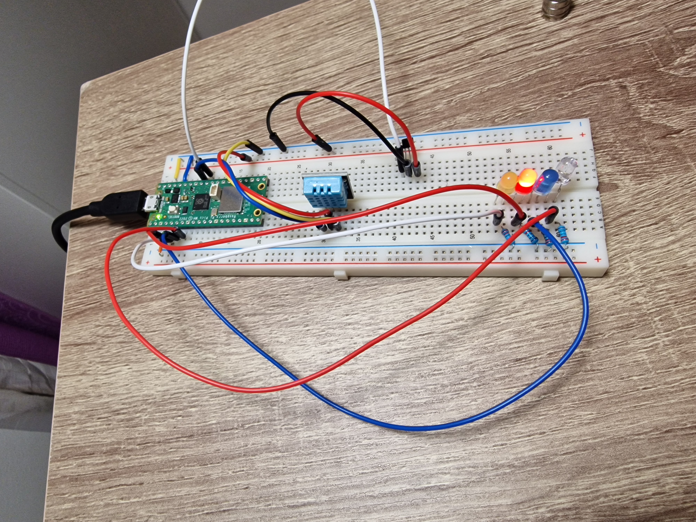

Temperature, Humidity and Magnetic Sensor Tutorial

Author
Yama Sabit (ys222fh)
Project Overview

This project involves creating a temperature, humidity and magnetic  sensor using a Raspberry Pi PicoW, a DHT11 sensor, TLV49645 sensor and an MQTT broker to publish the data to Adafruit IO. The estimated time to complete this project is approximately 4-6 hours.
Objective
Why This Project?

I chose to build this temperature, humidity, and magnetic sensor (TLV49645) using the starter kit I had available to monitor environmental conditions in real-time. This data can be useful for various applications such as home automation, weather monitoring, and checking for magnetic fields in agricultural purposes.

The main purpose of this project is to gather real-time temperature and humidity data, and check for magnetic fields, then publish it to an online dashboard for remote monitoring.

Insights:

This project will provide insights into the environmental conditions of a specific area, helping to understand trends and make informed decisions based on the data collected.

##Materials
List of Materials

Purchased from Electrokit Sweden AB as part of a startup kit:

    1x Raspberry Pi Pico WH (Artikelnr: 41019114)
    1x Breadboard 840 connections (Artikelnr: 10160840)
    1x USB cable A-male to micro B 5-pin male 1.8m (Artikelnr: 41003290)
    10x Jumper wires 30cm female/male (Artikelnr: 41012686)
    4x Resistors 0.25W 10kΩ (Artikelnr: 40810410)
    1x LED 5mm red diffuse 1500mcd (Artikelnr: 40307020)
    1x LED 5mm yellow diffuse 1500mcd (Artikelnr: 40307021)
    1x LED 5mm green diffuse 80mcd (Artikelnr: 40307023)
    1x LED 5mm green diffuse 80mcd (Artikelnr: 40307023)
    1x TLV49645 SIP-3 Hall-effect sensor digital (Artikelnr: 41015964)
    1x Magnet Neo35 Ø5mm x 5mm (Artikelnr: 41011480)
    1x Digital temperature and humidity sensor DHT11 (Artikelnr: 41015728)

Total Cost: 399 SEK (excluding tax and shipping)
Specifications and Costs

    Raspberry Pi Pico: Microcontroller with multiple GPIO pins.
    DHT11 Sensor: Measures temperature and humidity.
    TLV49645 SIP-3 Hall-effektsensor digital 
    LEDs: Indicators for different temperature ranges.
    Jumper Wires: For connections.
    Breadboard: For prototyping.
    Power Supply: 5V USB power source.

##Computer Setup
For the first-time connection, hold the BOOTSEL button on the Pico board while connecting it to your computer via USB. The Pico will appear as a USB drive. Drag and drop the MicroPython firmware file onto this drive, then restart the Pico.

Next, connect the Pico to your PC via USB. Install Visual Studio Code (VS Code) and add the Pymakr extension. From the left sidebar in VS Code, click on the device icon to connect to your Pico.

You can synchronize files in real-time, or you can manually upload files by clicking the upload button under the project section on the left side of VS Code. The Pico will restart and start executing the code. If you have output in the terminal, it will display the information there.
Chosen IDE

I used the VS Code IDE, which is specifically designed for MicroPython and works seamlessly with the Raspberry Pi Pico.
Steps to Setup

    Steps
    Install VS Code with the Pymakr Extension:
        Download and install Visual Studio Code from [code.visualstudio.com](https://code.visualstudio.com).
        Install the Pymakr extension for Pico from the VS Code Extensions Marketplace.

    Flash MicroPython Firmware:
        Connect the Pico to your computer while holding the BOOTSEL button.
        Download the latest MicroPython firmware from [micropython.org](https://micropython.org).
        Drag and drop the firmware onto the Pico.

Required Installations

    Node.js:
        Install Node.js for additional package installations if needed. Download it from [nodejs.org](https://nodejs.org).

    Drivers:
        Ensure USB drivers for the Pico are installed.

##Putting Everything Together
While putting everything together, you should read the pinout diagram of the Raspberry Pi Pico, which can be found online at the following link: [Raspberry Pi Pico Pinout](https://datasheets.raspberrypi.com/pico/Pico-R3-A4-Pinout.pdf).

Additionally, familiarize yourself with resistor color coding and read the information about the sensors to ensure correct connections.

##Circuit Diagram

Electrical Connections

    Connect DHT11 sensor to GPIO27.
    Connect the magnet sensor to GPIO26.
    Connect LEDs to GPIO2 (Red), GPIO3 (Yellow), GPIO4 (Blue), and GPIO5 (White).

##Platform Choice

I chose Adafruit IO for its ease of use and integration with MQTT. It offers a free tier that is sufficient for small-scale projects and allows easy scaling if needed.
Platform Details

    Functionality: Real-time data monitoring and visualization.
    Cost: Free tier available with options to upgrade.

##The Code
Core Functions

python

import time
import gc
from machine import ADC, unique_id, Pin
import ubinascii
from lib.umqtt_simple import MQTTClient
import lib.keys as keys
import dht

# Initialize Pins
redLight = Pin(2, Pin.OUT)
yellowLight = Pin(3, Pin.OUT)
blueLight = Pin(4, Pin.OUT)
whitelight = Pin(5, Pin.OUT)

# Initialize ADC
dht_sensor = dht.DHT11(Pin(27))
magnetSensor = Pin(26, mode=Pin.IN)

# MQTT publish function for the pico to adafruit
def publish_data(client, feed, data):
    try:
        client.connect()
        client.publish(feed, str(data))
        client.disconnect()
    except Exception as e:
        print('Failed to publish data:', e)

# Read temperature from the DHT11 sensor
def read_temperature_and_humidity():
    try:
        dht_sensor.measure()
        temp = dht_sensor.temperature()
        humidity = dht_sensor.humidity()
        print(f"Temperature: {temp}°C, Humidity: {humidity}%")
        return temp, humidity
    except Exception as e:
        print('Failed to read from DHT sensor:', e)
        return None, None

def readMagnet():
    try:
        value = magnetSensor.value()
        print(f"Magnet Sensor Value : {value}")
        whitelight.value(1 if value else 0)
        return value
    except Exception as e:
        print("Failed to print the data from magnet sensor")
        return None

def lightstemp(temp):
    if temp > 20:
        redLight.value(1)
        yellowLight.value(0)
        blueLight.value(0)
    elif temp < 0:
        yellowLight.value(1)
        redLight.value(0)
        blueLight.value(0)
    elif temp > 10 and temp < 20:
        blueLight.value(1)
        redLight.value(0)
        yellowLight.value(0)
    elif temp == 0:
        redLight.value(1)
        yellowLight.value(1)
    else:
        redLight.value(0)
        yellowLight.value(0)

def main():
    client = MQTTClient(keys.AIO_CLIENT_ID, keys.AIO_SERVER, keys.AIO_PORT, keys.AIO_USER, keys.AIO_KEY)
    client.connect()
    print('Connected to MQTT broker')
    
    while True:
        temp, humidity = read_temperature_and_humidity()
        if temp is not None:
            lightstemp(temp)
            publish_data(client, keys.AIO_TEMP_FEED, temp)
            publish_data(client, keys.AIO_humidity_FEED, humidity)

        magnet_value = readMagnet()
        if magnet_value:
            publish_data(client, keys.AIO_MAGNET_FEED, magnet_value)

        time.sleep(10)  # Publish data every 10 seconds
        gc.collect()

if __name__ == '__main__':
    main()

Explanation

    publish_data: Connects to the MQTT broker and publishes data.
    read_temperature_and_humidity: Reads temperature and humidity from the DHT11 sensor.
    readMagnet: Reads the value from the magnet sensor and controls the white LED.
    lightstemp: Controls the LEDs based on the temperature.
    main: Main function that initializes the MQTT client, continuously reads sensor data, and publishes it.

I have the keys.py file in the library folder to secure the keys. I have imported machine and ubinascii for binary data conversions. This file includes the WiFi SSID and password, as well as the configuration for Adafruit IO, which includes the username, key, feed ID, and feed address.

The second file in the library is the umqtt configuration file, and the third one is the WiFi connect file with two functions: connect and disconnect. These functions are called on Pico boot from boot.py to establish the connection. In the main boot.py, I have imported WiFi from the library folder and the main function so that it can call the wificonnection.connect function for WiFi and start the main function from the main file.

In the main function, I have imported the time library, garbage collector for Java, and ADC and Pin from the machine library. I have the MQTT file, WiFi keys, and DHT library for the DHT sensor. I have initialized the pins and sensors.

For publishing the data, I will take input from the client feed and data in order to publish it. The next function is to read the temperature and humidity sensor, which measures the temperature and humidity with the help of the DHT library and then returns both values. The next function reads values from the sensor. If the value is not zero, it will turn on the white LED.

The next function is the light function for the temperature sensor. It will take the temperature as input. If the value of the temperature is more than 20, it will turn on the red light; if less than zero, it will turn on the yellow light; if between 10 and 20, it will turn on the blue light with the help of if-else functions.

In the main function, first, I try to connect to the MQTT broker. If not connected, the message will point out in the terminal. If connected, it will read the data from temperature, humidity, and magnet sensors every 10 seconds and publish it to Adafruit IO.

Transmitting the Data / Connectivity
Data Transmission

    Frequency: Data is sent every 10 seconds.
    Protocols:
        Wireless: WiFi
        Transport: MQTT

##Design Choices

Choosing WiFi and MQTT ensures reliable data transmission over the internet and is suitable for real-time applications.
Presenting the Data
Dashboard

Data is visualized on Adafruit IO with customizable dashboards. Data is preserved for historical analysis. Data is saved in database for every 10 seconds.

##Finalizing the Design
Final Results

The project successfully monitors and publishes temperature and humidity data. The LEDs provide a quick visual indication of temperature ranges.
Final Thoughts

The project was successful and can be extended with additional sensors or functionality. Future improvements could include adding a web interface for easier monitoring and control.

Note(For security reason Adafruit IO Key has been chenged due to public view in github)
